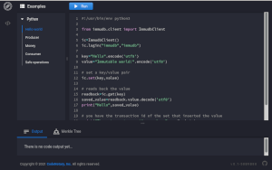

# immudb-py [](LICENSE)

[](https://github.com/codenotary/immudb-py/actions/workflows/ci.yml)
[](https://coveralls.io/github/codenotary/immudb-py?branch=master)[](https://slack.vchain.us/)
[](https://groups.google.com/group/immudb)

## Official [immudb] client for Python.

### Try it on the immudb Playground!

[](https://play.codenotary.com)

[immudb]: https://immudb.io

## Contents

- [Introduction](#introduction)
- [Prerequisites](#prerequisites)
- [Installation](#installation)
- [Supported Versions](#supported-versions)
- [Quickstart](#quickstart)
- [Step by step guide](#step-by-step-guide)
- [Creating a Client](#creating-a-client)

## Introduction

immu-py implements a [grpc] immudb client. A minimalist API is exposed for applications while cryptographic
verifications and state update protocol implementation are fully implemented by this client.
Latest validated immudb state may be kept in the local filesystem when using default `rootService`,
please read [immudb research paper] for details of how immutability is ensured by [immudb].

[grpc]: https://grpc.io/
[immudb research paper]: https://immudb.io/
[immudb]: https://immudb.io/

## Prerequisites

immu-py assumes there is an existing instance of the immudb server up and running. 
Running `immudb` is quite simple, please refer to the
following link for downloading and running it: https://immudb.io/docs/quickstart.html

immudb-py requires python version 3.6 or greater.
If you are using 3.6, you'll need dataclasses package; on 3.7+,
dataclasses is part of the python distribution.

## Installation

You can install latest version cloning this repository, and then use the make command to install
prerequisites and the package itself:

```shell
    make init
    make install
```

Or, you can install latest stable version using pip:

```shell
    pip3 install immudb-py
```

Then, in you code, import the client library as as follows:

```python
    from immudb import ImmudbClient
```

*Note*: immudb-py need `grpcio` module from google. On Alpine linux, you need
 these packages in order to correctly build (and install) grpcio:
 - `linux-headers`
 - `python3-dev`
 - `g++`

## Supported Versions

immu-py supports the [latest immudb release].

[latest immudb release]: https://github.com/codenotary/immudb/releases/tag/v0.9.0

## Quickstart

[Hello Immutable World!] example can be found in `immudb-client-examples` repo.

[Hello Immutable World!]: https://github.com/codenotary/immudb-client-examples/tree/master/python

## Step by step guide

### Creating a Client

The following code snippets shows how to create a client.

Using default configuration:

```python
    client = ImmudbClient()
```

Setting `immudb` url and port:

```python

    client = ImmudbClient("mycustomurl:someport")
    client = ImmudbClient("10.105.20.32:8899")
```

### User sessions

Use `login` and `logout` methods to initiate and terminate user sessions:

```python
    client.login("usr1", "pwd1");

    // Interact with immudb using logged user

    client.logout();
```
### Encoding

Please note that, in order to provide maximum flexibility, all functions accept byte arrays as parameters.
Therefore, unicode strings must be properly encoded.
It is possible to store structured objects, but they must be serialized (e.g., with pickle or json).

### Creating a database

Creating a new database is quite simple:

```python
    client.createDatabase(b"db1");
```

### Setting the active database

Specify the active database with:

```python
    client.useDatabase(b"db1");
```
If not specified, the default databased used is "defaultdb".

### Traditional read and write

immudb provides read and write operations that behave as a traditional
key-value store i.e. no cryptographic verification is done. This operations
may be used when validations can be post-poned:

```python
    client.set(b"k123", b"value123");
    result = client.get(b"k123");
```

### Verified read and write

immudb provides built-in cryptographic verification for any entry. The client
implements the mathematical validations while the application uses as a traditional
read or write operation:

```python
    try:
        client.verifiedSet(b"k123", b"v123");
        results = client.verifiedGet(b"k123");
    Except VerificationException as e:
        # Do something
```

### Multi-key read and write

Transactional multi-key read and write operations are supported by immudb and immudb-py.
Atomic multi-key write (all entries are persisted or none):

```python
    normal_dictionary = {b"key1": b"value1", b"key2": b"value2"}
    client.setAll(normal_dictionary);
```

Atomic multi-key read (all entries are retrieved or none):

```python
    normal_dictionary = {b"key1": b"value1", b"key2": b"value2"}
    results_dictionary = client.getAll(normal_dictionary.keys())
    # Or manually
    client.get([b"key1", b"key2"])
```
## User management
Users can be added and granted access to databases.

### Adding a user
The ```createUser``` functions create a new users and grants the specified permission to a database.
```python
user='newuser'
password='Pw1:pasdfoiu'
permission=immudb.constants.PERMISSION_RW
database='defaultdb'

client.createUser(user, password, permission, database)
```

The database must exists at the time the user is created. The password must be between 8 and 32 characters in length, and must have at least one upper case letter, a symbol and a digit.

Permission are defined in immudb.constants and are:

- `PERMISSION_SYS_ADMIN`
- `PERMISSION_ADMIN`
- `PERMISSION_NONE`
- `PERMISSION_R`
- `PERMISSION_RW`

### Changin password
The user must must provide both old and new password:
```python
newPassword="pW1:a0s98d7gfy"
resp=client.changePassword(user, newPassword, oldPassword)
```
It is applied the same password policy of user creation.

### User list

To get the list of user created on immudb, simply call ```listUsers```:
```python
resp=client.listUsers()
print(users.userlist.users)
```

### Closing the client

To programatically close the connection with immudb server use the `shutdown` operation:

```python
    client.shutdown();
```

Note: after shutdown, a new client needs to be created to establish a new connection.

## State persistance

An important immudb feature is the ability for a client to check every transaction for tampering. In order to 
be able to do that, it is necessary to persist client state (i.e., save it to disk) so that if some tampering 
on the server happens between two runs, it is immediatly detected.

A `RootService` implements just that: it stores immudb client after every transaction, in order to be able to
use it afterward to check the server correctness.

### Using the Persistent Root Service

The default RootService, for simplicity, commits the state to RAM, and so it is unsuitable for real time safe
application. To have persistance, the application must instantiate a `PersistentRootService` object, which stores
its state to disk.

Let's see a simple example that uses state persistance:

```python
from immudb.client import ImmudbClient, PersistentRootService
client=ImmudbClient(rs=PersistentRootService())
client.login(username="immudb", password="immudb")
client.verifiedTxById(42)
client.verifiedGet(b"example")
```

In this example, the Root Service is saved to the disk after every verified transaction. As you can see, it is very
easy to use. Just create and use the PersistentRootService object in the client initialization.

### Process and threads

Please keep in mind that the implementation is not thread/process safe. If you are using a multi-process application,
it is advisable to use a different state file for every instance: just pass the filename as argument to the 
PersistentRootService constructor:

```python
client = ImmudbClient(rs=PersistentRootService("rootfilename"))
```

Default rootfile is "~/.immudbRoot"

If needed/wanted, it is also easy to extend the default implementation adding synchronization primitives to the get/set methods.
In this way, more than one immudb client can share the same PersistentRootService instance without interering each other.

## Cryptographic state signing

To increase safety, it is possible to generate a private key and use it to sign every verification response. Clients can
then use the corresponding public key to check for response correctness.

### Key generation
You can use `openssl` to create a private key, and then extract the public key:
```sh
openssl ecparam -name prime256v1 -genkey -noout -out private_signing_key.pem
openssl ec -in private_signing_key.pem -pubout -out public_signing_key.pem
```

### Key usage (server side)
On immudb server, use `--signingKey private_signing_key.pem` to activate cryptographic signature.

### Key usage (client/SDK side)

On immudb python SDK, just pass the public key filename to the ImmudbClient constructor:
```python
client=ImmudbClient(publicKeyFile="/certs/public_signing_key.pem")
```
Every transaction will be then automatically checked. An exception is thrown if the cryptographic check fails.

## Contributing

We welcome contributions. Feel free to join the team!

To report bugs or get help, use [GitHub's issues].

[GitHub's issues]: https://github.com/codenotary/immudb-py/issues
